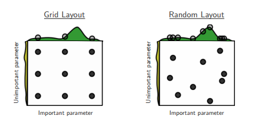

# 机器学习纳米学位
# 监督学习
## 项目: 为CharityML寻找捐献者
### 安装

这个项目要求使用 Python 2.7 并且需要安装下面这些python包：

- [Python 2.7](https://www.python.org/download/releases/2.7/)
- [NumPy](http://www.numpy.org/)
- [Pandas](http://pandas.pydata.org/)
- [scikit-learn](http://scikit-learn.org/stable/)
- [matplotlib](http://matplotlib.org/)

你同样需要安装好相应软件使之能够运行 [iPython Notebook](http://ipython.org/notebook.html)

优达学城推荐学生安装[Anaconda](https://www.continuum.io/downloads), 这是一个已经打包好的python发行版，它包含了我们这个项目需要的所有的库和软件。

### 代码

初始代码包含在`finding_donors.ipynb`这个notebook文件中。你还会用到`visuals.py`和名为`census.csv`的数据文件来完成这个项目。我们已经为你提供了一部分代码，但还有些功能需要你来实现才能以完成这个项目。
这里面有一些代码已经实现好来帮助你开始项目，但是为了完成项目，你还需要实现附加的功能。  
注意包含在`visuals.py`中的代码设计成一个外部导入的功能，而不是打算学生去修改。如果你对notebook中创建的可视化感兴趣，你也可以去查看这些代码。


### 运行
在命令行中，确保当前目录为 `finding_donors/` 文件夹的最顶层（目录包含本 README 文件），运行下列命令：

```bash
jupyter notebook finding_donors.ipynb
```

​这会启动 Jupyter Notebook 并把项目文件打开在你的浏览器中。

### 数据

修改的人口普查数据集含有将近32,000个数据点，每一个数据点含有13个特征。这个数据集是Ron Kohavi的论文*"Scaling Up the Accuracy of Naive-Bayes Classifiers: a Decision-Tree Hybrid",*中数据集的一个修改版本。你能够在[这里](https://www.aaai.org/Papers/KDD/1996/KDD96-033.pdf)找到论文，在[UCI的网站](https://archive.ics.uci.edu/ml/datasets/Census+Income)找到原始数据集。

**特征**

- `age`: 一个整数，表示被调查者的年龄。 
- `workclass`: 一个类别变量表示被调查者的通常劳动类型，允许的值有 {Private, Self-emp-not-inc, Self-emp-inc, Federal-gov, Local-gov, State-gov, Without-pay, Never-worked}
- `education_level`: 一个类别变量表示教育程度，允许的值有 {Bachelors, Some-college, 11th, HS-grad, Prof-school, Assoc-acdm, Assoc-voc, 9th, 7th-8th, 12th, Masters, 1st-4th, 10th, Doctorate, 5th-6th, Preschool}
- `education-num`: 一个整数表示在学校学习了多少年 
- `marital-status`: 一个类别变量，允许的值有 {Married-civ-spouse, Divorced, Never-married, Separated, Widowed, Married-spouse-absent, Married-AF-spouse} 
- `occupation`: 一个类别变量表示一般的职业领域，允许的值有 {Tech-support, Craft-repair, Other-service, Sales, Exec-managerial, Prof-specialty, Handlers-cleaners, Machine-op-inspct, Adm-clerical, Farming-fishing, Transport-moving, Priv-house-serv, Protective-serv, Armed-Forces}
- `relationship`: 一个类别变量表示家庭情况，允许的值有 {Wife, Own-child, Husband, Not-in-family, Other-relative, Unmarried}
- `race`: 一个类别变量表示人种，允许的值有 {White, Asian-Pac-Islander, Amer-Indian-Eskimo, Other, Black} 
- `sex`: 一个类别变量表示性别，允许的值有 {Female, Male} 
- `capital-gain`: 连续值。 
- `capital-loss`: 连续值。 
- `hours-per-week`: 连续值。 
- `native-country`: 一个类别变量表示原始的国家，允许的值有 {United-States, Cambodia, England, Puerto-Rico, Canada, Germany, Outlying-US(Guam-USVI-etc), India, Japan, Greece, South, China, Cuba, Iran, Honduras, Philippines, Italy, Poland, Jamaica, Vietnam, Mexico, Portugal, Ireland, France, Dominican-Republic, Laos, Ecuador, Taiwan, Haiti, Columbia, Hungary, Guatemala, Nicaragua, Scotland, Thailand, Yugoslavia, El-Salvador, Trinadad&Tobago, Peru, Hong, Holand-Netherlands}

**目标变量**

- `income`: 一个类别变量，表示收入属于那个类别，允许的值有 {<=50K, >50K}

### 项目审阅反馈

#### 集成算法
你还可以尝试 AdaBoost, Gradient Boosting等集成算法．

其中, Gradient Boosting 是 Kaggle 比赛上很受欢迎的算法, 以下是一个 Kaggler 对GB的详细解释, 鼓励你去看看:
https://gormanalysis.com/gradient-boosting-explained/

以下这个网页对GB进行了极其badass的可视化:
http://arogozhnikov.github.io/2016/06/24/gradient_boosting_explained.html

更可以了解"加强版" Gradient Boost---ＸGBoost
http://machinelearningmastery.com/gentle-introduction-xgboost-applied-machine-learning/

#### 优缺点

关于常见模型的优缺点，以下这个页面给了超级简单的总结:
http://www.lauradhamilton.com/machine-learning-algorithm-cheat-sheet
中文的比较好的资料:
http://bigsec.com/bigsec-news/anan-20161111-jiqixuexi
其他一些复杂的模型, 比如集成方法的优缺点需要你去一些讨论热烈的地方去寻找, 比如随机森林在Quora就有很好的讨论:
https://www.quora.com/When-is-a-random-forest-a-poor-choice-relative-to-other-algorithms

还有一个方法就是活用页面搜索，在对应算法的维基百科页, 论文或sklearn user guide中， ctrl + F. 搜索一些评价算法比较关注的词: overfit, accuracy, bias, time, speed, complexity, generalization等以及它们的不同词性．看看它们是怎么被描述的．

但关键还是了解算法的原理，这样才能辨识让人眼花缭乱的网上资料是否准确

应用场景

可以在百度学术搜索，相应模型的名称作为关键词，这样做的好处是你可以在左侧边栏看到不同领域的文章有多少．

#### 随机调参

`Decision Tree` 的可调参数还是有很多的，所以使用[随机调参](http://scikit-learn.org/stable/modules/generated/sklearn.model_selection.RandomizedSearchCV.html)可以节省由遍历搜索所耗费的大量时间，同时，最终调参得到的模型性能还是有保证的。



```python
clf = ... # 模型
param_dist = ... # 参数列表
n_iter_search = ... # 你想要搜索的次数
random_search = RandomizedSearchCV(clf, param_distributions=param_dist, n_iter=n_iter_search)
random_search.fit(X, y)
```

可以从这里阅读到gridsearch与randomsearch两者的比较。你也可以从这篇[通俗易懂的论文](http://www.jmlr.org/papers/volume13/bergstra12a/bergstra12a.pdf)了解到更多相关的知识。

> 数据和特征决定了机器学习的上限，而模型和算法只是逼近这个上限而已。

在特征上的提高大部分需要特定领域的知识以及一些insight idea。所以，在这里我们谈谈从算法的角度来逼近这个上限。一般在kaggle比赛上获奖的大多是经过stacking后的融合模型。

- 你可以从[这里](http://blog.kaggle.com/2016/12/27/a-kagglers-guide-to-model-stacking-in-practice/)了解到stacking的基本原理
- 你可以从[这里](https://www.kaggle.com/arthurtok/introduction-to-ensembling-stacking-in-python)把stacking实践应用到真实的数据上，得到很不错的分数
- 或许你需要了解这个强大的机器学习的库mlxtend，[像sklearn一样直接调用stacking](https://rasbt.github.io/mlxtend/user_guide/classifier/StackingClassifier/)
- 尝试得到更大的提高吧

尽管我们得到了一个很不错的模型，但是如果我们把模型完全当成一个黑箱，就会失去挖掘知识的机会，所以一定的数据探索是很有必要的，下面举个用plotly画图的例子(注:在导入plotly的时候，你需要在命令行执行 `pip install plotly` 下载相关的package):
```python
import plotly.graph_objs as go
from plotly.offline import init_notebook_mode, iplot
init_notebook_mode(connected=True)
trace1 = go.Histogram(x = X_train[y_train==0]['education-num'].values, name='0') # 这里选择画出柱状图
trace2 = go.Histogram(x = X_train[y_train==1]['education-num'].values, name='1')
data = [trace1, trace2]
iplot(data)
```